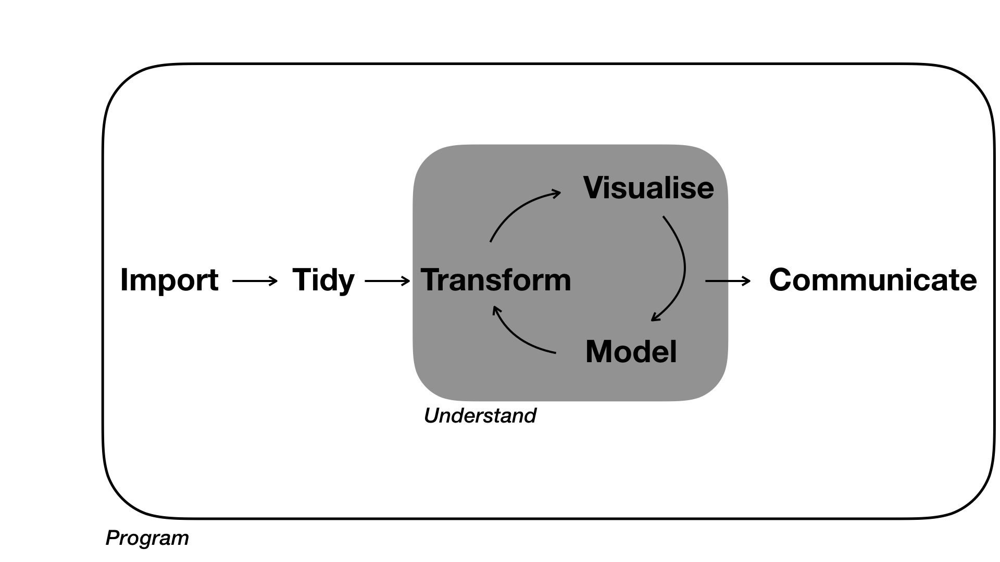
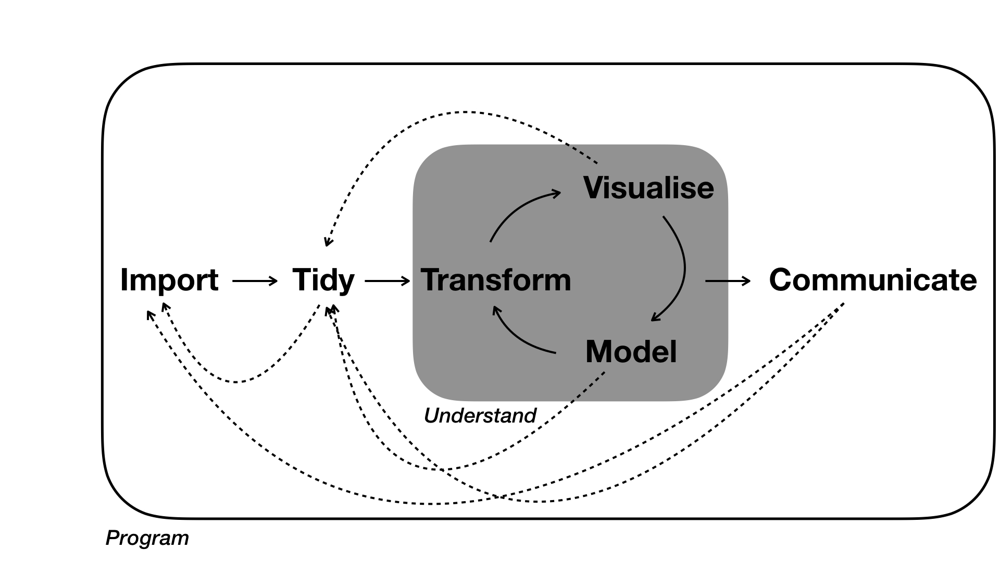
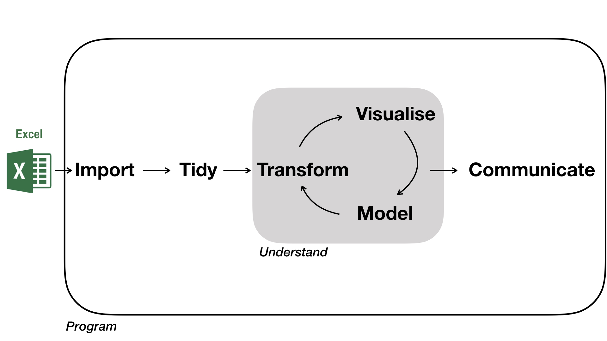

# Data Analysis

_Data analysis_ is a term that describes the process of turning raw data into knowledge. This involves data import, data wrangling, statistical data analysis, and communicating the findings. 

[Grolemund & Wickham, 2017](https://r4ds.had.co.nz/workflow-basics.html) presented this as a diagram. 

Adapted from <a href="https://r4ds.had.co.nz/introduction.html">R for Data Science by Grolemund & Wickham, 2017.</a>

The diagram makes clear, that the data analysis workflow consists of different modules that depend on the previous one, and that there is directionality in the flow: an entrance, iteration and an exit. It also emphasises that _tidy data_ is important for the analysis, that _understanding_ is an iterative process, that the analysis is a portable & isolated box. Lastly, communicating/sharing of results is key. 

If you would like to further read about the different modules, have a look at the [R for Data Science](https://r4ds.had.co.nz/) book.

## Data analysis in reality

In reality, data wrangling is rarely a linear process, but instead a forth and back between modules. Therefore, _flexibility_ in moving between these modules with software, along with _automation_ is important. This can be achieved with written programs that can be re-executed at any time. 

## Role of Excel

If you have used another tool previously, for example _Excel_, then this will still be relevant for _data entry & storage_. 

The article [Data Organization in Spreadsheets](https://www.tandfonline.com/doi/full/10.1080/00031305.2017.1375989) by Broman & Woo (2018) provides recommendations for organizing spreadsheet data in a way that both humans and computer programs can read.

## Requirements to data analysis software

Apart from moving through modules with ease, what other criteria are important when choosing a data analysis software? 

Software should should be used by others (otherwise, sharing code becomes difficult), be continuously developed & improved (new data formats, new communication formats), easy to use (high-level language). 

## More

If you are interested in the data analysis workflow in general, have a look at the [R for Data Science](https://r4ds.had.co.nz/) book. 

And if you are interested in another formalisation of _data analysis_ have a look at recent work by [Hicks & Peng, 2019](https://arxiv.org/abs/1903.07639). _Elements & Principles_ lays out the elements that build a data analysis, and the principles in assembling them.

