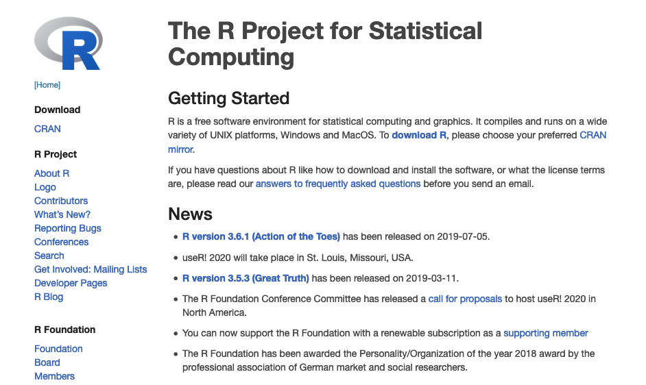
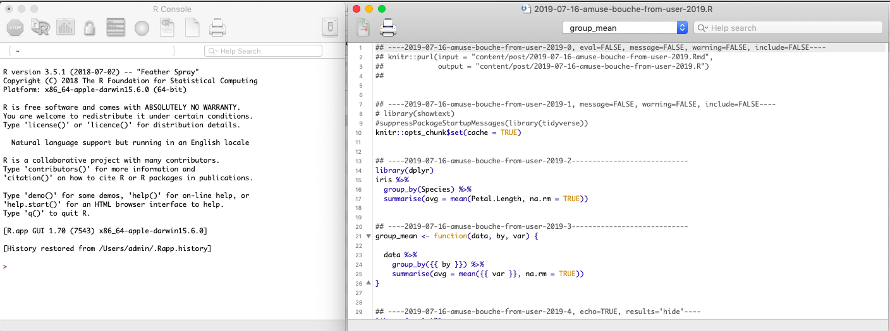
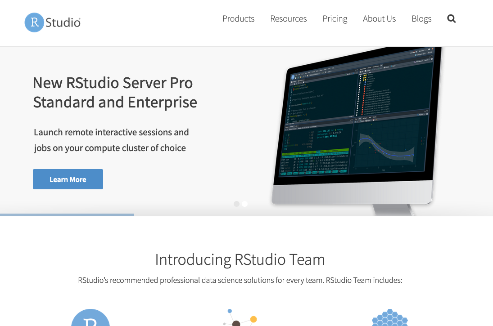
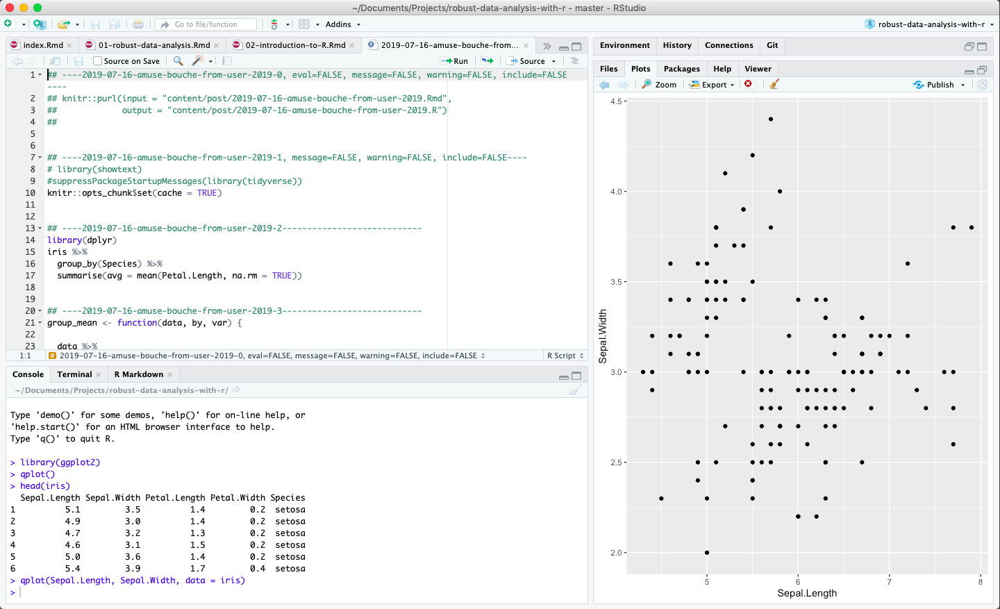

# Introduction to R

> As developers, “tidyevalutions” helps us make sure the user do as little typing as possible and can express really rich ideas [for analysis]. This is what underlies ggplot2 and some of our other libraries (Editor’s note: ggplot2 is a popular data visualization library.) The idea is to get things out of your head and on to the computer as quickly as possible.

https://qz.com/1661487/hadley-wickham-on-the-future-of-r-python-and-the-tidyverse/

[R](https://www.r-project.org/) was developed for statistical data analysis. Or more precisely: The R Project for Statistical Computing.

It is a free software and anyone can contribute to the software by creating a _package_. 

Just celebrated its [25 year anniversary](https://rss.onlinelibrary.wiley.com/doi/10.1111/j.1740-9713.2018.01169.x)

While it was developed to do mainly statistical computations (e.g. regression models) and data visualisation, it has now a lot of additional features that are somehow related to statistics, but could stand on its own. 

Comes with *basic*/*default* packages, but there are over 13'000 R-packages that can be installed through [CRAN](https://cran.r-project.org/web/packages/) or repositories like github.

## What is R used for?

Lots of (but not all) data science, data analysis & stats stuff

## Capabilities of R

Extract from presentation by <a href="https://docs.google.com/presentation/d/1VK1hngMZSY3FT2SrDd4_AHiB28CHrsuSsaFr7r3SAL8/edit#slide=id.p">Heidi Seibold</a>

Beyond being a calculator and being able to estimate statistical models, R can help us to organise the data analysis workflow better. 

- **Communication of results** 
  - through literate programming: `RMarkdown` (blogdown, bookdown, this!)
  - through a web application: `shiny`
- **Data visualisation**: `gganimate`, `ggplot2`, `ggmap`
- **APIs**
  - [access an API](https://medium.com/epfl-extension-school/an-illustrated-introduction-to-apis-10f8000313b9) (_So the API is a layer of code that sits between the database and most database users._)
  - [produce an API](https://medium.com/tmobile-tech/r-can-api-c184951a24a3) (also [these resouces (h/t Sharla Gelfand)](https://twitter.com/sharlagelfand/status/1157794847438364679))

## Some terminology: Functions, libraries and scripts

- Programming typically works like this: you apply a function to an object. 

- You could also say that you apply an **action** (a verb) to an **object** (a noun). 

- This is an important property, because a chain of such verbs can create a _programming script_. 

- Library or package is a **collection of functions**. Anyone can contribute a package to R.

- Script: function, arguments, pacakage, libraary, objects

## R vs. RStudio

### R

- https://www.r-project.org/

- core
- anyone can contribute a package
- Show print screen / website
- Download here: https://stat.ethz.ch/CRAN/

Website of <a href="https://www.r-project.org/">R Project</a>

Screenshot from <a href="https://www.r-project.org/">R Project Website</a>

### RStudio

- IDE (integrated development environment) to R
- Works for any platform
- Free for individual users

Website of <a href="https://www.rstudio.com/">RStudio</a>

Screenshot of <a href="https://www.rstudio.com/">RStudio</a>

- User Interface for R
- Works for any computer system (MacOSx, Linux, Windows)
- [Desktop version is free](https://www.rstudio.com/products/rstudio/#Desktop)) if you are an individual user
- develop a lot of new packages, e.g. [shiny](https://www.rstudio.com/products/shiny/)
- anything between teaching and solutions for production
- Where are things in RStudio?: https://twitter.com/RLadiesNCL/status/1138812826917724160/photo/1
- Download here: https://www.rstudio.com/products/rstudio/download/

## Programming language vs. natural language

Similar to a natural language, a programming langugage helps you to communicate with the computer, and even with colleagues. For example, a data analysis described in a manuscript can also be written as an R script. 

## More

- Some [history of R](https://statfr.blogspot.com/2018/08/r-generation-story-of-statistical.html)
- [How to install R and RStudio](https://courses.edx.org/courses/UTAustinX/UT.7.01x/3T2014/56c5437b88fa43cf828bff5371c6a924/)
- To use git, github and RStudio, checkout [Happy git with R](https://happygitwithr.com/).

