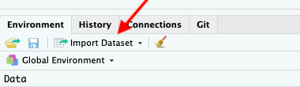

# Workshop

The goal of the workshop is to cover most of the [data analysis workflow](#data-analysis). This includes:

- _Importing_ data into R
- Making data analysis-ready through _tidying & transformation_
- _Visualising_ data
- Creating a report to _communicate_ our findings

We will use data describing drug use in the US and meteorite falls around the world:

1. `drug_use` is a dataset that is provided through [a package](https://cran.r-project.org/web/packages/fivethirtyeight/vignettes/fivethirtyeight.html) by [fivethirtyeight](https://fivethirtyeight.com/). If you type `data()` into the console, you will see a list of other "in-house" datasets, and if you type for example `?iris` you will see the description of the famous flower dataset. Using an R dataset can be useful when you do not want to bother with the data import but instead focus on learning. 
1. The meteorite data was provided by [TidyTuesday](https://github.com/rfordatascience/tidytuesday). TidyTuesday will be discussed [later](#look-for-a-steady-stream-of-data-or-exercises), but in summary, it is a weekly release of a dataset that has already been tamed.  

We will guide you through the four R-scripts and below are some extra tips and information. 

## RStudio Cloud

For the workshop, we are going to use [RStudio Cloud](https://rstudio.cloud/spaces/24655/join?access_code=nN9TW6co5lZRS5yKGO4Xp1ZChDUXoyCGVzamIzXQ). 

First, click on the following link: http://bit.ly/rds-rstudio. Then log in with a Google account, Github account or any email address. 

Loading RStudio Cloud might take a while. Once it appears, click on the tab `Project`, choose `Workshop` and then `Make a permanent copy`.


<!-------------------------------->
## Data visualisation
<!-------------------------------->

The main data visualisation engine these days is the `ggplot2` package. 

<div class="figure">

<p class="caption">Artwork by <a href="https://github.com/allisonhorst/stats-illustrations">@ allison_horst</a></p>
</div>

The main advantage of `ggplot2` is the recipe-like structure, also called _grammar_. However, depending on your needs (e.g. interactivity) there are [more suitable packages](#neat-packages-functions). 


<!-------------------------------->
## Import data
<!-------------------------------->

Getting data into R can be cumbersome. This is mainly because datasets need to be stored in a format that R understands^[Practical recommendations for organizing spreadsheet data in a way that both humans and computer programs can read: [Data Organization in Spreadsheets](https://www.tandfonline.com/doi/full/10.1080/00031305.2017.1375989) by Broman & Woo (2018).]. When we want to import data from others^[If you are the person supplying yourself with data, make sure that you always store the data consistently, e.g. space delimited. This way, reading data into R becomes easier.], we need to tell R how the data looks, which can result in a command like this: 

```
read.table("dataset.csv", 
           sep = ",",
           fill = TRUE, 
           row.names = TRUE, 
           header = FALSE,
         col.names = paste0("V", seq_len(ncol)))
```

Instead of remembering this difficult command, RStudio helps us with this button on the top-right in the tab "Environment". 

<div class="figure">

</div>

This allows us to import Excel or rectangular text files, and then copy+paste the complicated command into the R-script for reproducibility. 


<!-------------------------------->
## Tidy + Transform Data
<!-------------------------------->

Before doing any actual data analysis, we need to bring the data into an analysis-friendly format. Although we humans like datasets that offer a quick overview with several columns, R prefers to have what is called [_tidy data_](https://r4ds.had.co.nz/tidy-data.html). A dataset is tidy when: 

  - Each variable has its own column.
  - Each observation has its row.
  - Each value has its own cell.
  
Here is an example that is not tidy.  

```
 age       n alcohol_use cocaine_use marijuana_use
 12     2798         3.9         0.1           1.1
 13     2757         8.5         0.1           3.4
 14     2792        18.1         0.1           8.7
 ```

```{r eval=FALSE, include=FALSE}
drug_use %>%
select(age, n, alcohol_use, cocaine_use, marijuana_use) %>%
 pivot_longer(ends_with("_use"),
   names_to = c("drug"),
   values_to = "use"
 )
```

But this is a tidy version: 
```
 age       n drug            use
 12     2798 alcohol_use     3.9
 12     2798 cocaine_use     0.1
 12     2798 marijuana_use   1.1
 13     2757 alcohol_use     8.5
 13     2757 cocaine_use     0.1
 13     2757 marijuana_use   3.4
 14     2792 alcohol_use    18.1
 14     2792 cocaine_use     0.1
 14     2792 marijuana_use   8.7
 15     2956 alcohol_use    29.2
...
```

To get to a tidy dataset, we use _reshaping_ functions from the `tidyr`. 

Other steps in the data preparation process are _data transformation_ and _data cleaning_. This step of the data analysis workflow is highly interactive, and one often jumps from one to the other. For example, when doing a descriptive analysis of your dataset you might discover implausible values, which will need to be treated in the data transformation part. 

This is one reason why scripts are so important. If you forgot something in a step right after the data import you can simply add the command and re-run the script. 

Here is the list of handy R packages for data preparation: 

- [`tidyr`](https://tidyr.tidyverse.org/) for reshaping the data
- [`dplyr`](https://dplyr.tidyverse.org/) for transforming the data
- [`janitor`](http://sfirke.github.io/janitor/) for data cleaning


<div class="figure">

<p class="caption">Artwork by <a href="https://github.com/allisonhorst/stats-illustrations">@ allison_horst</a></p>
</div>


<!-------------------------------->
## Report with RMarkdown
<!-------------------------------->

In the last script, we will bundle everything we learned into one R script. You might notice that this does not have the typical `.R` file extension, but instead `.Rmd`. `.Rmd` means RMarkdown and combines the power of [Markdown](https://en.wikipedia.org/wiki/Markdown) and R. This form of mixing programming and writing is also called _literal programming_. 

[RMarkdown](https://rmarkdown.rstudio.com/) files can be used to create documents, such as a presentation, a website (html) or a document (word or pdf).

Here are some links to dive into RMarkdown

- [Markdown cheatsheet](https://github.com/adam-p/markdown-here/wiki/Markdown-Cheatsheet)
- [RMarkdown RStudio cheatsheet](https://resources.rstudio.com/rstudio-cheatsheets/rmarkdown-2-0-cheat-sheet).
- [Pimp my .Rmd: a few tips for R Markdown](https://holtzy.github.io/Pimp-my-rmd/)
- [RMarkdown for Scientists](https://rmd4sci.njtierney.com/)


<div class="figure">

<p class="caption">Artwork by <a href="https://github.com/allisonhorst/stats-illustrations">@ allison_horst</a></p>
</div>

