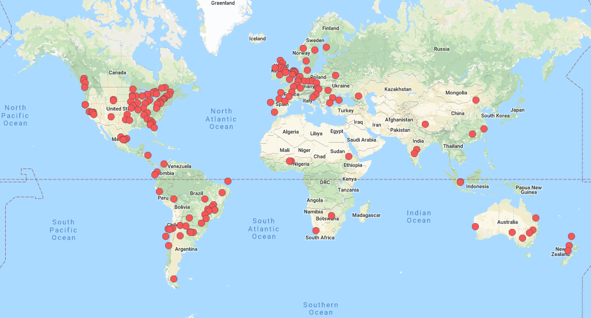

# Learning R

## Learning strategies

Here is a selection of different learning strategies, and the best is, if you can apply them all. The basic idea is, to have exposure to the language, as you do, when you learn a natural language. 

<!-------
- Learn with isolated & digestable examples
- Sources of examples: tidytuesday, advent of code / tidies of march (irene steves)
- Listen to podcasts or watch videos: https://www.rstats.nyc/2019/nyr/ / community calls: https://ropensci.org/commcalls/
- Make use of pen + paper
-------->

### Learn with isolated & digestable examples {-}
First, make sure to not overwhelm yourself with trying to learn everything at once. Better is, to stick to isolated examples. For example, instead of trying to tackle the whole data analysis workflow all at once, try to become better at data reshaping first. And instead of using your own data, with which you might first struggle to import into R, use the dataset that R already provides. 

### Look for a steady stream of data or exercises {-}

The [TidyTuesday](https://github.com/rfordatascience/tidytuesday) data supply was created to have "toy" data to practice data visualization and basic data wrangling in R. 

Since their start in 2018 they have now over 70 datasets. These datasets are "tamed", but not always tidy.

Watch out for an upcominig code puzzle initiative similar to [advent of code](https://adventofcode.com/) by [Irene Steves](https://irene.rbind.io/post/summer-rstudio/).

### Watch recordings

Many small & large R conferences record their speakers:

- New York R conference [recordings](https://www.rstats.nyc/2019/nyr/)
- Yearly R conference [recordings](https://www.youtube.com/channel/UC_R5smHVXRYGhZYDJsnXTwg)
- RStudio conference [recordings](https://resources.rstudio.com/rstudio-conf-2019)

[rOpenSci]() has monthly [community calls](https://ropensci.org/commcalls/). 

Some R users record their R usage with _screencasts_:

- [Nic Crane](https://twitter.com/nic_crane/status/1150496452218671106)
- [Dan Quintana](https://twitter.com/dsquintana/status/1166083585771802626)

<!------- or attend a conference, screen casts --------->

### Read blogposts

The best resource for new blogposts or any other R news is [Rweekly](https://rweekly.org/), a community-driven initiative. 

## Embrace imperfection

Learning a programming language can be discouraging. Things might not work from start, and it will constantly feel like everyone else is more proficient and ahead of you. 

Keep in mind that there is no such thing as a perfect R-script. Of course, there are best-practices, but writing an R-script will always be a interative process, where you start and after some weeks you might have learned something, and you want to improve it. 

Another reason to not strive for perfection, is that R offers a variety of solutions for one problem. For example, there are many different ways how to import data into R, or how to subset your data. So it is very likely that your R-scripts will look different from any other one. 

Instead of feeling discouraged, you should embrace imperfection and take it as a driving force to learn more. 

### Exploit imperfection

You can even exploit imperfection with four tips:

- **Look & review each others code**: Ask your colleagues at work if they would like to spend 30 minutes looking at your code. In return, you can do the same for them. This will not only give you (and them) insight into other code, but also force you to produce reproducible code.

- **Rewrite your code**: You will constantly improve your R skills. Don't refrain from rewriting your own R code (while keeping the output the same). This ideally goes hand in hand with [unit tests](https://testthat.r-lib.org/). 

- **Look at open source code**: Watch out for public repositories (for example [this one](https://github.com/seabbs/DirectEffBCGPolicyChange)). This is another great way to see how others write R scripts and how they make sure that their repository is reproducible. 

## How to ask for help

What do you do if you have a question, for example you get an error message, something is not working as intended or you simply want to know if there is any other possibility? 

### 1. Look online {-}

First, scan the web by simply copy and pasting the error message. This will most likely direct you to the following two websites:

- [Stack Overflow](https://stackoverflow.com/) (SO)
- [RStudio Community](https://community.rstudio.com/)

Sometimes the error message is too specific, and you might want to describe the problems in words when searching. 

### 2. Create a reproducible example {-}

If you cannot find any existing solution to your problem, you can post your question online. It is important to make your question public to everyone, so others will be able to look up the solution later. To increase the likelihood of getting an answer and feedback, it is important to provide a reproducible example. Here is the workflow of doing this:

First, you try to reproduce the error message with a dataset within R, e.g. the `iris` dataset. The `iris` dataset is relatively small and contains a mixture of numeric and factor variables. 

Very often, working out a small example will already solve your problem. Solely, by thinking about the problem, you will find the solution yourself. 

If not, install the `reprex` package. Then highlight the code of your reproducible example, choose in the `Addins` _Reprex selection_ (see video [here](https://resources.rstudio.com/webinars/help-me-help-you-creating-reproducible-examples-jenny-bryan)).

1. create a reproducbile example using a small R available dataset (e.g. iris)
1. `install.packages("reprex")`
1. select code and run reprex

https://github.com/jules32/useR-2019-keynote/tree/gh-pages/img

<!---- this will often already guide you to the solution -------> 

### 3. Ask on SO, twitter, RStudio help {-}

Once you have your reproducible example, post it in one of the follwing places:

- Ask within an online community. This is a good place to start, because protected through Code of Conducts.

- Ask the [RStudio community](https://community.rstudio.com/)

- Ask on [Stack Overflow](https://stackoverflow.com/)

- Twitter using the `#rstats` hashtag: 

<!-------
More: https://masalmon.eu/2018/07/22/wheretogethelp/
- If its a bug: file an issue on github

Why not writing directly to the maintainer? Because online helps
----->

## Become part of the community

### R-Ladies 

[R-Ladies](Leading the R community forwards in widening the participation of women and other under-represented groups.) is a world-wide organisation to promote gender diversity in the R community. 

As a diversity initiative^[[RForwards](https://forwards.github.io/] is another initiative to lead the R community forwards in widen the participation of women and other under-represented groups.], the mission of R-Ladies is to achieve proportionate representation by encouraging, inspiring, and empowering people of genders currently underrepresented in the R community. 

At the moment, there are 167 R-Ladies chapters (local R user groups) in 47 countries.

### What does R-Ladies do?

R-Ladies has a [Code of Conduct](https://rladies.org/code-of-conduct/) that ensures that R-Ladies meetups and online communication are safe spaces. 

For women and gender minorities R-Ladies offers:

- [Slack](https://rladies-community-slack.herokuapp.com/) 
- [Abstract / Scholarship review process](tinyurl.com/rladiesabstracts)
- [R-Ladies directory](http://rladies.org/directory/)

### Join an online community

- R for Data Science online learning community: https://www.rfordatasci.com/ (slack, tidytuesday): https://rfordatascience.slack.com/

- R-ladies Slack: https://www.rfordatasci.com/

- French-speaking [r-grrr Slack](https://r-grrr.slack.com/join/shared_invite/enQtMzI4MzgwNTc4OTAxLWZlOGZiZTBiMWU0NDQ3OTYzOGE1YThiODgwZWNhNWEyYjI4ZDJiNmNhY2YyYWI5YzFiOTFkNDYxYzkwODUwNWM) (+ [online ressources](https://github.com/frrrenchies/frrrenchies))

### [rOpenSci](https://ropensci.org)

> rOpenSci fosters a culture that values open and reproducible research using shared data and reusable software.

The non-profit initiative founded in 2011 builds software with a community of users and developers and educates scientists about transparent research practices.

A good place to get familiar with rOpenSci is, to attend or re-watch a community call ([archive](https://ropensci.org/commcalls/)). You can also contribute via the shinyapp (https://ropensci.shinyapps.io/contributr/).

### Join an R meetup

R meetups and R user groups are great places to meet other people and to exchange knowledge!

There are several R meetups in the lemanic region: 

- [R-Ladies](http://use-r-carlvogt.github.io/prochains-lunchs/) in Lausanne
- [RUG](https://www.meetup.com/Geneve-R-User-Group) in Geneva
- [R lunches](http://use-r-carlvogt.github.io/prochains-lunchs/) in Geneva
- [adminR](https://www.meetup.com/adminR/) 

If you are a women or gender minority and work remotely or are in another sense "remote", there is [R-Ladies Remote](https://twitter.com/RLadiesRemote) (coffee chats, journal club). 

You can find the full list of RUG's [here](https://jumpingrivers.github.io/meetingsR/r-user-groups.html) and for R-Ladies [here](https://www.meetup.com/pro/rladies/).

### Write blogposts

Writing blogposts can be a fun way of learning R. For example, document your journey of learning R. 

Even if you do not have a blog, you can start with [gist.github.com](https://gist.github.com/) and later move to [`blogdown`](). 

Do not forget to submit your blogpost to [rweekly](https://rweekly.org)!

### Engage on Twitter

Twitter is a fun place to see new R features and learn about R. Here are four fun handles to follow: 

- [Mara Averick](https://twitter.com/dataandme)
- [Maëlle Salmon](https://twitter.com/ma_salmon)
- [R for the rest of us](https://twitter.com/rfortherest)
- [WeAreRLadies](https://twitter.com/WeAreRLadies/status/1154698236583698432)

