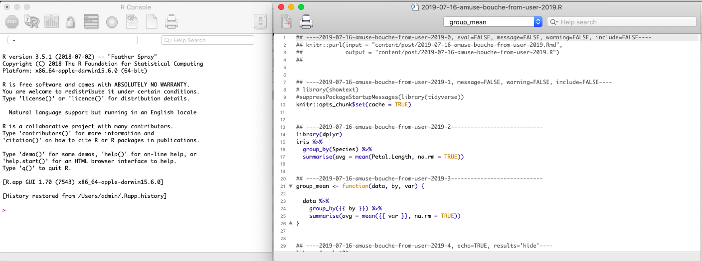
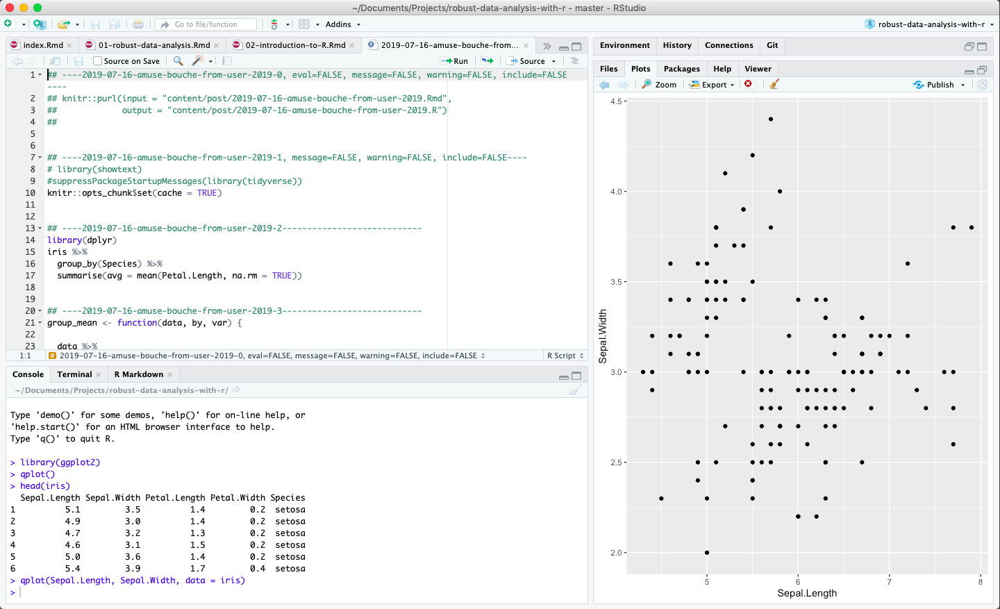

<!--------- 
https://www.helpessentials.com/2017/08/02/sprinkle-some-google-fonts-into-your-projects/
--------->

```{r xaringan-themer, include = FALSE}
library(xaringanthemer)
mono_light(
  base_color = "#2b2d2f",
  white_color = "#ffffff", 
  header_font_google = google_font("Karla", "700i"), ## Oswald
  header_font_url = "https://fonts.googleapis.com/css?family=Karla:400,700,400italic",
  text_font_google   = google_font("Karla", "400", "700i"),  ## Roboto
  code_font_google   = google_font("Inconsolata"),#,
  text_font_size = "30px"
  )
```


```{r, setup, include = FALSE}
knitr::opts_chunk$set(echo = TRUE)
options(knitr.kable.NA = '')
library(knitr)
library(kableExtra)
library(magrittr)
library(stringr)
library(ggplot2)

library(dplyr)
theme_set(hrbrthemes::theme_ipsum(subtitle_size = 14, caption_size = 9, axis_title_size = 12)) ## make sure to 

```


<!---------------------- ToC ------------------------------>

---
class: left, middle

# Who we are

.pull-left-large[
## Sina

- **Background** in Data Science and Biostatistics
- Works with genomic and clinical **data**

`r icon::fa_twitter()` <small>@sinarueeger</small><br />
`r icon::fa_github()` <small>@sinarueeger</small><br />
<!----- `r icon::fa_link()` <small>sinarueeger.github.io</small> -------->

]

.pull-right-small[
## Allie

- **Background** in Biology and Bioinformatics
- Works with ... **data**

`r icon::fa_twitter()` <small>@imallieburns</small><br />
`r icon::fa_github()` <small>@allie-burns</small><br />


]


<!---------------------- SLIDE info ------------------------------>

<!--- adding a footer https://github.com/yihui/xaringan/wiki/Footer-and-header-lines ------>
---
class: left, middle

## **Slides** &emsp; <small>http://bit.ly/rds-slides</small>

## **Handbook** &emsp; <small>http://bit.ly/rds-handbook</small>

## **RStudio Cloud** &emsp; <small>http://bit.ly/rds-rstudio</small>

## Github repository &emsp; <small>http://bit.ly/rds-repo</small>


<!---------------------- ToC ------------------------------>

---
class: left, middle

.pull-left[
# **1. **
### [What makes a Data Analysis robust?](#part-1-data-analysis)

<br>

# **3. ** 
### [Workshop](#part-3-workshop) 

]

.pull-right[
# **2. ** 
### [How can R help with that?](#part-2-r)

<br>

# **4.** 
### [How can we learn R?](#part-4-learning-r)
]


<!------------------------------------------------------->
<!---------------------- PART 1 ------------------------->
<!------------------------------------------------------->
---
class: left, middle, inverse

# Part 1
# <a name="part-1-data-analysis"></a>Data Analysis


---
class: left, middle

# Data Analysis Workflow

<div class="figure">

<p class="caption">From <a href="https://r4ds.had.co.nz/introduction.html">R for Data Science by Grolemund & Wickham, 2017.</a></p>
</div>

---
exclude: true
# Emojification of Data Analysis Workflow


### `r emo::ji("thinking")` `r icon::fa_arrow_right(colour = "gray")` `r icon::fa_table(colour = "black")` `r icon::fa_arrow_right(color = "gray")` `r icon::fa_laptop(colour = "#377eb8")` `r icon::fa_arrows_alt(color = "gray")` `r icon::fa_r_project(colour = "#377eb8")` `r icon::fa_arrow_right(colour = "gray")` `r icon::fa_chart_line(color = "#f03b20")` `r icon::fa_arrow_right(colour = "gray")` `r icon::fa_lightbulb(color = "#31a354")` `r icon::fa_arrow_right(colour = "gray")` `r icon::fa_map_signs(color = "#d95f0e")`
<!--- question > getting data > analysing / distill knowledge > do soemthing with that -->

<!------`Question > Data > Analyse data with a tool > Distill knowlege from data > Feel enlightened :-) > Take decisions` ------->

---
exclude: true

<div class="figure">

<p class="caption">Artwork by <a href="https://github.com/allisonhorst/stats-illustrations">@allison_horst</a> for <a href="https://www.openscapes.org/">openscapes</a></p>
</div>

 


---
class: left, middle

# Principles

- tidying data
- reproducibility
- entrance → iterate → exit workflow 
- sharing of results

---
class: left, middle

# Requirements to Software

- easy data manipulation
- enhance reproducibility 
- used by others
- ease of use
- continuously developed & improved
- sharing ready results + scripts

---
class: left, middle

# What makes a Data Analysis _robust_?

Revisiting steps easily


<!------------------------------------------------------->
<!--------------- Thought experiment -------------------->
<!------------------------------------------------------->
---
class: left, middle, inverse

# Thought experiment


---
class: left, top

## Q1: 
### What is the most annoying & repetitive task at work? 
--
<br>
## Q2: 
### How could you automate it? 

---
class: left, middle

# Automation

Programming is essentially an automation of a process
- for common tasks
- scalable
- complicated tasks
- where precision is needed 
- to reuse frameworks
- to redo something from the past

Side effect: reproducibility. 

---
class: left, middle, inverse


<!------------------------------------------------------->
<!---------------------- PART 2 ------------------------->
<!------------------------------------------------------->
---
class: left, middle, inverse

# Part 2
# <a name="part-2-r"></a>R


---
class: left, middle

> <p><small>As developers, “tidyevalutions” helps us make sure the user do as little typing as possible and can express really rich ideas [for analysis]. This is what underlies ggplot2 and some of our other libraries (Editor’s note: ggplot2 is a popular data visualization library.)</p></small> The idea is to get things out of your head and on to the computer as quickly as possible.

[Interview with Hadley Wickham in 2019](https://qz.com/1661487/hadley-wickham-on-the-future-of-r-python-and-the-tidyverse/)


---
class: left, middle

# R

- is "a programming language for statistical computing"
- is free
- has a webpage: https://www.r-project.org/
- just celebrated its [25 year anniversary](https://rss.onlinelibrary.wiley.com/doi/10.1111/j.1740-9713.2018.01169.x)
- comes with *basic*/*default* packages, but there are over 13'000 R-packages `r emo::ji("open_mouth")` that can be installed through [CRAN](https://cran.r-project.org/web/packages/) or repositories like github


---
class: center, middle

# What is R used for?

---
class: middle

# Quite a few things

In general lots of (but not all) data science, data analysis & stats stuff


???

_sdflkjfdksjdf_.

---
class: left, middle

# Capabilities of R


Beyond being a calculator and being able to estimate statistical models, R can help us to organise the data analysis workflow better. 

- **Communication of results** 
  - through literate programming: `RMarkdown`
  - through a web application: `shiny`
- **Data visualisation**: ggplot2`
- Access **APIs**


---
class: left, middle

# R is constantly evolving & improving


---
class: left, middle

# Some terms: Functions

- Programming typically works like this: you apply a function to an object. 
- You could also say that you apply an **action** (a verb) to an **object** (a noun). 
- This is an important propertiy, because a chain of such verbs can create a _programming script_. 


---
class: left, middle

# Some terms: Libraries

- Library or package is a **collection of functions**. 

- Anyone can contribute a package.  

---
class: left, middle

# Some terms: programming script


- Example with plot: function, arguments, package/library, objects


---
class: left, middle

# R
- Core development of R
- Anyone can contribute a package

<div class="figure">
<a href="https://www.r-project.org/">

<p class="caption">Screenshot from <a href="https://www.r-project.org/">R Project Website</a></p>
</div>


---
class: left, middle

# RStudio
- IDE (integrated development environment) to R
- Works for any platform
- Free for individual users

<div class="figure">
<a href="https://www.rstudio.com/">

<p class="caption">Screenshot of <a href="https://www.rstudio.com/">RStudio</a></p>
</div>

]


---
class: left, middle

# Programming language vs. natural language


- Data analysis workflow divides the DA into modules.

- R helps you to express these moduls for your analysis. 

- Similar to natural languages: tool to communicate with others. Programming: communication with computer (+colleagues).


---
exclude: true

# Hierarchy of best practices

1. documentation (`lintr`)
1. run all script (`usethis`)
1. version control (`gitr`)
1. unit tests and sanity checks (`testthat`, `assertr`)
1. write functions, package them and tell everyone (`devtools`, `blogdown`)
1. continuous integration (`devtools`, `blogdown`)
1. makefile (caching) (`drake`)
1. binder (`holepunch`)

---
class: left, middle

# R in the wild

---
class: left, middle

## Research compendium:

<div class="figure">
<a href="https://github.com/seabbs/DirectEffBCGPolicyChange">

</a>
<p class="caption">Source: <a href="https://github.com/seabbs/DirectEffBCGPolicyChange">DirectEffBCGPolicyChange by Sam Abbott</a></p>
</div>


---
class: left, middle

## Blogpost: [Analysing mouse autism data](https://notstatschat.rbind.io/2019/06/16/analysing-the-mouse-autism-data/)

<div class="figure">
<a href="https://notstatschat.rbind.io/2019/06/16/analysing-the-mouse-autism-data/">

</a>
<p class="caption">Source: <a href="https://notstatschat.rbind.io/2019/06/16/analysing-the-mouse-autism-data/">Analysing mouse autism data</a></p>
</div>

---
class: left, middle

## Data journalism

<div class="figure">
<a href="https://www.srf.ch/static/srf-data/data/2018/federer/#/en">

</a>
<p class="caption">Source: <a href="https://www.srf.ch/static/srf-data/data/2018/federer/#/en">SRF</a></p>
</div>


---

## Data journalism

<div class="figure">
<a href="https://srfdata.github.io/2018-01-roger-federer/#load_data">

</a>
<p class="caption">Source: <a href="https://www.srf.ch/static/srf-data/data/2018/federer/#/en">SRF</a></p>
</div>


---

## Web application with Shiny

<div class="figure">
<a href="https://kevinrue.shinyapps.io/isee-shiny-contest/">

</a>
<p class="caption">Source: <a href="https://blog.rstudio.com/2019/04/05/first-shiny-contest-winners/">Winner of the Shiny Contest 2019</a></p>
</div>


---

## Animations

<div class="figure">
<a href="https://raw.githubusercontent.com/gadenbuie/tidy-animated-verbs/master/images/anti-join.gif">

</a>
<p class="caption">Source: <a href="https://github.com/gadenbuie/tidy-animated-verbs#tidy-animated-verbs">Github @gadenbuie</a></p>
</div>


---

## Fun things: Memes and GIFs

<div class="figure">
<a href="http://djnavarro.net/post/2018-05-03-valid-social-commentary/">

</a>
<p class="caption">Source: <a href="http://djnavarro.net/post/2018-05-03-valid-social-commentary/">Danielle Navaro</a></p>
</div>


---
class: center, middle


<div class="figure">

<p class="caption">Artwork by <a href="https://github.com/allisonhorst/stats-illustrations">@allison_horst</a></p>
</div>


---
class: left, middle, inverse

<!------------------------------------------------------->
<!---------------------- PART 3 ------------------------->
<!------------------------------------------------------->
---
class: left, middle, inverse

# Part 3
# <a name="part-3-workshop"></a>Workshop


---
class: left, middle

# Goal

<div class="figure">

<p class="caption">From <a href="https://r4ds.had.co.nz/introduction.html">R for Data Science by Grolemund & Wickham, 2017.</a></p>
</div>

- Make a data visualisation
- Import data into R
- Make the data analysis-ready
- Create a report that gives insights into meteorite falls around the world.


???

_two steps: make changes + add things_.


---
class: left, middle

# Get started

Go to RStudio Cloud

http://bit.ly/rds-workshop

Click `Make permanent copy`

---
class: left, middle, inverse

---
class: left, middle

# Data visualisation

Open `src/1-dataviz.R`

---
class: left, middle

## Aim

Analyse the use of different drugs in the states with respect to age


## Data
```{r echo=FALSE}
library(fivethirtyeight)
kable(drug_use[1:3, 1:5])
```

---
class: left, middle

<div class="figure">

<p class="caption">Artwork by <a href="https://github.com/allisonhorst/stats-illustrations">@allison_horst</a></p>
</div>


---
class: left, middle

## Glimpse


| *Function*      |  `   ` | *Purpose*   |
| :-----        |    :----:   |          :------ |
| 1. `skim()`      |         | A. Show the first 6 lines   |
| 2. `head()`   |          | B. Summarize data with mean, etc.      |
| 3. `summary()`   |          | C. Displaying summary statistics     |

---
class: left, middle

## Glimpse


| *Function*      |  `   ` | *Purpose*   |
| :-----        |    :----:   |          :------ |
| 1. `skim()`      |         |  C. Displaying summary statistics  |
| 2. `head()`   |          | A. Show the first 6 lines      |
| 3. `summary()`   |          | B. Summarize data with mean, etc.     |


---
class: left, middle

## Plotting

| *Functions*  |  *Purpose* |
|---|---|
| 1. Create a plot   | A. `ylim()` |
| 2. Create a scatterplot |  B. `theme_set()` |
| 3. Create panels | C. `ggsave()` |
| 4. Adjust the y-axis limits |  D.  `geom_point()`  |
| 5. Change the y-axis labels  |  E. `ggplot()` |
| 6. Set a theme  |  F. `facet_wrap()` |
| 7. Save a plot | G.  `ylab()` |


---
class: left, middle

## Plotting

| *Functions*  |  *Purpose* |
|---|---|
| 1. Create a plot   | E. `ggplot()` |
| 2. Create a scatterplot |  D. `geom_point()`|
| 3. Create panels | F. `facet_wrap()` |
| 4. Adjust the y-axis limits | A. `ylim()`  |
| 5. Change the y-axis labels  |  G. `ylab()` |
| 6. Set a theme  |  B. `theme_set()` |
| 7. Save a plot | C. `ggsave()`  |


---
class: left, middle


## Instructions
- Make prediction
- Execute first bit
- As a user, what would you like to change? 

---
class: left, middle


## Task
- add two other drugs to the plot
- limit age range
- add the variable n into the plot
- add a smoother spline
- add color to points
- add a title
- have drug on the x axis and age as a facetting
- change pdf > png


---
class: left, middle

# Import Data
Open `src/2-import-data.R`


## Aim

Import an Excel and a text-delimited file.

---
class: left, middle


| *Functions*  |  *Purpose* |
|---|---|
| 1. `read_excel()`   | A. Turn the column names into nice names |
| 2. `read_delim()` | B. Import a delimited text file  |
| 3. `clean_names()` |  C. Write a delimited text file |
| 4. `read_csv()`  |  D.  Import an Excel file |
| 5. `write_delim()`  |  E. Import a comma delimited text file|


---
class: left, middle


| *Functions*  |  *Purpose* |
|---|---|
| 1. `read_excel()`   | D. Import an Excel file |
| 2. `read_delim()` | B. Import a delimited text file  |
| 3. `clean_names()` | A . Turn the column names into nice names |
| 4. `read_csv()`  |  E. Import a comma delimited text file |
| 5. `write_delim()`  |  C. Write a delimited text file |


---
class: left, middle

## This button is your friend


---
class: left, middle

## Task

- import `tmp/otherfile.xlsx` table
- import `tmp/otherfile.txt` data
- write `.xlsx` file


---
class: left, middle, inverse


---
class: left, middle

# Tidy + Transform Data
Open `src/3-tidy-data.R`

---
class: left, middle

## Aim

Get the metorite fall data analysis-ready. 

## Data
```{r echo=FALSE, message=FALSE, warning=FALSE}
dat_raw <- readr::read_csv("https://raw.githubusercontent.com/rfordatascience/tidytuesday/master/data/2019/2019-06-11/meteorites.csv")

kable(dat_raw[1:3, c("name", "class", "mass", "year", "lat", "long")])
```


---
class: left, middle

## Data manipulation

| *Functions*  |  *Purpose* |
|---|---|
| 1. Contigency table of `var`  | A.  `slice(3)`  |
| 2. Extract all rows that have values > 2 |  B. `mutate(var = var_0 + var_1)` |
| 3. Create a new variable from `var_0` and `var_1`| C.  `tabyl(var)`|
| 4. Rename a column | D. `filter(var > 2)` |
| 5. Extract row #3 | E.  `rename(new_name = old_name)` |


---
class: left, middle

## Data manipulation

| *Functions*  |  *Purpose* |
|---|---|
| 6. Group by a variable | F. `group_by(var) %>% summarize(mean(x))`|
| 7. Calculate the mean of a variable | G. `group_by(var)`|
| 8. Select a column | H. `summarise(mean(var))` |
| 9. Calculate the mean of `x` for each level in `var` | I. `select(var)` |


---
class: left, middle

<div class="figure">

<p class="caption">Artwork by <a href="https://github.com/allisonhorst/stats-illustrations">@allison_horst</a></p>
</div>


---
class: left, middle

## Task

- add a column with `mutate()`
- rename a column with `rename()`
- filter rows with `filter()`
- summarise ... with `group_by` + `summarise`


---
class: left, middle, inverse

---
class: left, middle

# Report with RMarkdown
Open `src/4-report.Rmd`

## Aim

Create a report for the meteorite fall data.

---
class: left, middle

### R chunks

```

```{r, some-options}
```

```

### Inline R
` `r ` ` 


---
class: left, middle

## RMarkdown

| *Functions*  |  *Purpose* |
|---|---|
| 1. Create a table  | A. `geom_line()` |
| 2. Make a histogram |  B. `kable()`|
| 3. Make a line plot | C. `geom_histogram()` |


---
class: left, middle

## RMarkdown

| *Functions*  |  *Purpose* |
|---|---|
| 1. Create a table  | B. `kable()` |
| 2. Make a histogram | C. `geom_histogram()`|
| 3. Make a line plot | A. `geom_line()` |


---
class: left, middle

<div class="figure">

<p class="caption">Artwork by <a href="https://github.com/allisonhorst/stats-illustrations">@allison_horst</a></p>
</div>


---
class: left, middle

# Task

- add your name as the author
- change the title into something you like
- export as pdf/word/markdown

---
class: left, middle

## Good to know
- rmarkdown: https://holtzy.github.io/Pimp-my-rmd/
- more about RMarkdown here: https://rmd4sci.njtierney.com/
- Look into xaringan and CSS file, more by [Alison Hill](https://arm.rbind.io/slides/xaringan.html)
- code download button: https://twitter.com/apreshill/status/1108925218850893832


---
class: left, middle

<div class="figure">

<p class="caption">Artwork by <a href="https://github.com/allisonhorst/stats-illustrations">@allison_horst</a></p>
</div>


---
exclude: true

# Commenting & Documentation

- How much documentation do you need? 
  - Think about your future self
  - Add simple instructions and ask a colleague to do it
- For structure use simple commands (align, lintr)
- A good exercise: look at an old script and reformat.
- [Reprohack!](https://sheffield-university.shinyapps.io/ReproHack_CCMcr/)


---
class: left, middle, inverse


---
class: left, middle

<div class="figure">

<p class="caption">Source <a href="https://happygitwithr.com/">Happy Git with R by Jenny Bryan</a></p>
</div>


---
class: left, middle

# Git & R

--
1. Use git. 
--

2. Read [*Happy Git with R*](https://happygitwithr.com/). 
--

3. Use the handy *git interface* in RStudio. 
--

4. `r emo::ji("party")`
--

5. Use [gist.github.com](https://gist.github.com/) to share & store code snippets, notes, thoughts and blogposts. 


---
class: left, middle, inverse

<!------------------------------------------------------->
<!---------------------- PART 4 ------------------------->
<!------------------------------------------------------->
---
class: left, middle, inverse


# Part 4
# <a name="part-4-learning-r"></a>Learning R

<!----------------------------------------------->

---
class: center, middle

# Learning strategies
<!-------
- Learn with isolated & digestable examples
- Surroud yourself with the language: embed R into your life
- Sources of examples: tidytuesday, advent of code / tidies of march (irene steves)
- Listen to podcasts or watch videos: https://www.rstats.nyc/2019/nyr/ / community calls: https://ropensci.org/commcalls/
- Make use of pen + paper
-------->

---
class: left, middle

## 1. Learn with isolated & digestable examples

---
class: left, middle

## 2. Surround yourself with the language: embed R into your life

---
class: left, middle

## 3. Look for a steady stream of data or exercises

[tidytuesday](https://github.com/rfordatascience/tidytuesday)s

---
class: left, middle

## 4. Watch recordings

- New York R conference [recordings](https://www.rstats.nyc/2019/nyr/)
- R conference [recordings](https://www.youtube.com/channel/UC_R5smHVXRYGhZYDJsnXTwg)
- RStudio conference [recordings](https://resources.rstudio.com/rstudio-conf-2019)
- rOpenSci community call [archive](https://ropensci.org/commcalls/)
<!------- or attend a conference, screen casts --------->


---
class: center, middle

# Use of pen + paper

<!----------------------------------------------->
---
class: center, middle

# Embrace imperfection

---
class: left, middle


## 1. Programming is an iterative process

## 2. 1 Problem = 1+ solutions

---
class: left, middle

## Exploit imperfection

- Look at & review each others code

- Rewrite your code

- Look at open source code


---
class: center, middle

# Find neat packages & functions

---
class: center, middle

## 1. Data import

- different r packages to import data: [`{readr}`](), [`{data.table}`]()
- `{datapasta}`: https://twitter.com/dataandme/status/1148548556850114561
- `{fabricatr}`: https://rviews.rstudio.com/2019/07/01/imagine-your-data-before-you-collect-it/

---
class: left, middle

## 2. Data manipulation

- [`{dplyr`}]()
- [`{janitor`}]() package


---
class: center, middle

## 3. Dataviz

- ['{esquisse}'](https://github.com/dreamRs/esquisse) to interactively create a plot. 
- many other \#dataviz libraries in R: [`{gganimate}`](https://github.com/thomasp85/gganimate), [`{plotly}`](https://plot.ly/r/), [`{vegalite}`](https://github.com/hrbrmstr/vegalite)
- [R Graph Gallery](https://www.r-graph-gallery.com/)
- Publication ready plots with [`{cowplot}`](https://github.com/wilkelab/cowplot) and [`{ggpubr}`](https://github.com/kassambara/ggpubr)


---
class: left, bottom

.pull-left[
## ggpubr

Annotate plot with meta data

<div class="figure">

<p class="caption">Produced by <a href="https://github.com/kassambara/ggpubr">ggpubr package</a></p>
</div>


]

.pull-right[

Arrange plots

<div class="figure">

<p class="caption">Produced by <a href="https://github.com/kassambara/ggpubr">ggpubr package</a></p>
</div>

]


---
class: left, middle

<div class="figure">

<p class="caption">Artwork by <a href="https://github.com/allisonhorst/stats-illustrations">@allison_horst</a></p>
</div>

---
class: left, middle, inverse

---
class: enteriddle

# Cheatsheets


<!----------------------------------------------->
---
class: center, middle

# How to ask for help


---
class: left, middle

## 1. Look online

- [Stack Overflow](https://stackoverflow.com/) (SO)
- [RStudio Community](https://community.rstudio.com/)


---
class: left, middle

<div class="figure">

<p class="caption">Artwork by <a href="https://github.com/allisonhorst/stats-illustrations">@allison_horst</a></p>
</div>


---
class: left, middle

## 2. Create a reproducible example

1. create a reproducbile example using a small R available dataset (e.g. iris)
1. `install.packages("reprex")`
1. select code and run reprex


<!---- this will often already guide you to the solution -------> 

---
class: left, middle

## 3. Ask on SO, twitter, RStudio help

C+P r bit into one of the follwing streams:

- Ask within a community (R-Ladies, R4DS)
- https://community.rstudio.com/
- https://stackoverflow.com/
- Twitter using the `#rstats` hashtag: 

<!-------
More: https://masalmon.eu/2018/07/22/wheretogethelp/
- If its a bug: file an issue on github

Why not writing directly to the maintainer? Because online helps
----->


<!----------------------------------------------->
---
class: center, middle

# Welcome to the R family! 

--
### Become part of the community
<!------------
- blogposts (rweekly!)
- R user group (RUG, R-Ladies)
- list: https://jumpingrivers.github.io/meetingsR/r-user-groups.html (if you know a meetup, make a PR)
- CoC
- R-Ladies
- French [slack](https://r-grrr.slack.com/join/shared_invite/enQtMzI4MzgwNTc4OTAxLWZlOGZiZTBiMWU0NDQ3OTYzOGE1YThiODgwZWNhNWEyYjI4ZDJiNmNhY2YyYWI5YzFiOTFkNDYxYzkwODUwNWM) + [online ressources](https://github.com/frrrenchies/frrrenchies)
- other languages
- R for DS (slack, tidytuesday)
- ropensci community calls / shinyapp (https://ropensci.shinyapps.io/contributr/)
- engage on twitter ([R for the rest of us](https://twitter.com/rfortherest) + [weareRLadies](https://twitter.com/WeAreRLadies/status/1154698236583698432) + [Mara Averick](https://twitter.com/dataandme) + [maelle Salmon](https://twitter.com/ma_salmon))
----->


---
class: left, middle


<div class="figure">

<p class="caption">Artwork by <a href="https://github.com/allisonhorst/stats-illustrations">@allison_horst</a></p>
</div>


---
class: left, middle

## R-Ladies 


???

_mention code of conduct_.


---
class: left, middle

## Join an online community

- R for Data Science online learning community: https://www.rfordatasci.com/ (slack, tidytuesday)
- R-ladies Slack: https://www.rfordatasci.com/
- French-speaking [r-grrr Slack](https://r-grrr.slack.com/join/shared_invite/enQtMzI4MzgwNTc4OTAxLWZlOGZiZTBiMWU0NDQ3OTYzOGE1YThiODgwZWNhNWEyYjI4ZDJiNmNhY2YyYWI5YzFiOTFkNDYxYzkwODUwNWM) (+ [online resources](https://github.com/frrrenchies/frrrenchies))


---
class: left, middle

## [rOpenSci](https://ropensci.org)

- Attend a community call ([archive](https://ropensci.org/commcalls/)).

- Contribute via the [shinyapp](https://ropensci.shinyapps.io/contributr/)


---
class: left, middle

## Join an R meetup

---
class: left, middle

### Lemanic region: 
- [R-Ladies](http://use-r-carlvogt.github.io/prochains-lunchs/)
- [Geneve RUG](https://www.meetup.com/Geneve-R-User-Group)
- [R lunches](http://use-r-carlvogt.github.io/prochains-lunchs/)
- [adminR](https://twitter.com/RLadiesRemote)

### [R Ladies Remote](https://twitter.com/RLadiesRemote) 
- Coffee chats
- Journal club

Full list of RUG's [here](https://jumpingrivers.github.io/meetingsR/r-user-groups.html) and for R-Ladies [here](https://gqueiroz.shinyapps.io/rshinylady/).


---
class: left, middle

## Read blogposts

Weekly supply of blogposts here: https://rweekly.org/.


---
class: left, middle

## Write blogposts

Start with gist.github.com, then move to blogdown. 


---
class: left, middle

## Engage on Twitter

Lots of cool #rstats folks on twitter. For example: 

- [Mara Averick: @dataandme](https://twitter.com/dataandme)
- [Maëlle Salmon: @ma_salmon](https://twitter.com/ma_salmon)
- [R for the rest of us: @rfortherest](https://twitter.com/rfortherest)
- [WeAreRLadies: @WeAreRLadies](https://twitter.com/WeAreRLadies)


---
class: left, middle


<div class="figure">

<p class="caption">Artwork by <a href="https://github.com/allisonhorst/stats-illustrations">@allison_horst</a> for <a href="https://www.openscapes.org/">openscapes</a></p>
</div>


<!----------------------------------------------->
---
class: center, middle

# .large[Questions?]


---
class: left, middle

<div class="figure">

<p class="caption">Artwork by <a href="https://github.com/allisonhorst/stats-illustrations">@allison_horst</a> for <a href="https://www.openscapes.org/">openscapes</a></p>
</div>

