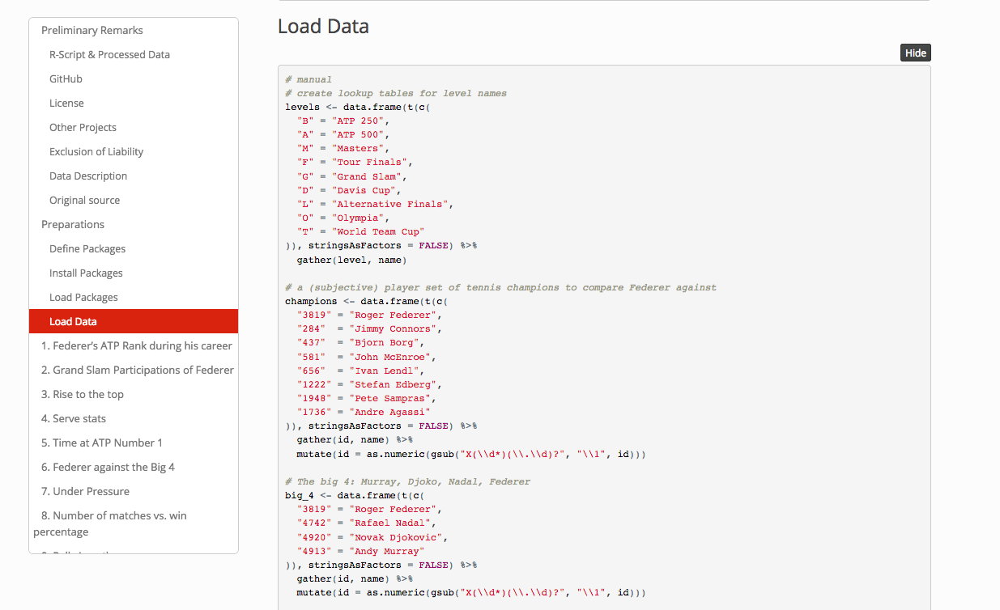

<!--------- 
https://www.helpessentials.com/2017/08/02/sprinkle-some-google-fonts-into-your-projects/
--------->

```{r xaringan-themer, include = FALSE}
library(xaringanthemer)
mono_light(
  base_color = "#2b2d2f",
  white_color = "#ffffff", 
  header_font_google = google_font("Karla", "700i"), ## Oswald
  header_font_url = "https://fonts.googleapis.com/css?family=Karla:400,700,400italic",
  text_font_google   = google_font("Karla", "400", "700i"),  ## Roboto
  code_font_google   = google_font("Inconsolata"),#,
  text_font_size = "30px"
  )
```


```{r, setup, include = FALSE}
knitr::opts_chunk$set(echo = TRUE)
options(knitr.kable.NA = '')
library(knitr)
library(kableExtra)
library(magrittr)
library(stringr)
library(ggplot2)

library(dplyr)
theme_set(hrbrthemes::theme_ipsum(subtitle_size = 14, caption_size = 9, axis_title_size = 12)) ## make sure to 

```


<!---------------------- ToC ------------------------------>

---
class: left, middle

# Who we are

.pull-left-large[
## Sina

- **Background** in Data Science and Biostatistics
- Works with genomic and clinical **data**

`r icon::fa_twitter()` <small>@sinarueeger</small><br />
`r icon::fa_github()` <small>@sinarueeger</small><br />
<!----- `r icon::fa_link()` <small>sinarueeger.github.io</small> -------->

]

.pull-right-small[
## Allie

- **Background** in Biology and Bioinformatics
- Works with ... **data**

`r icon::fa_twitter()` <small>@imallieburns</small><br />
`r icon::fa_github()` <small>@allie-burns</small><br />


]


<!---------------------- SLIDE info ------------------------------>

<!--- adding a footer https://github.com/yihui/xaringan/wiki/Footer-and-header-lines ------>
---
class: left, middle

## Slides
### &nbsp;&nbsp;&nbsp;&nbsp;&nbsp;&nbsp;&nbsp;&nbsp; http://bit.ly/rds-slides

## Handbook
### &nbsp;&nbsp;&nbsp;&nbsp;&nbsp;&nbsp;&nbsp;&nbsp; http://bit.ly/rds-handbook

## RStudio Cloud
### &nbsp;&nbsp;&nbsp;&nbsp;&nbsp;&nbsp;&nbsp;&nbsp; http://bit.ly/rds-rstudio


<!---------------------- ToC ------------------------------>

---
class: left, middle

<div class="figure">

<p class="caption">Artwork by <a href="https://github.com/allisonhorst/stats-illustrations">@allison_horst</a> for <a href="https://www.openscapes.org/">openscapes</a></p>
</div>


---
class: left, middle

## 1. [Data Analysis](#part-1-data-analysis)
<!------- What makes a Data Analysis robust?------>

## 2. [Introducing R](#part-2-r)
<!--------How can R help with that?----------->

## 3. [Workshop](#part-3-workshop) 

## 4. [Beyond the Basics](#part-4-beyond-the-basics)

## 5. [Learning R](#part-5-learning-r)


<!------------------------------------------------------->
<!---------------------- PART 1 ------------------------->
<!------------------------------------------------------->
---
class: left, middle, inverse

# Part 1
# <a name="part-1-data-analysis"></a>Data Analysis


---
class: left, middle

# Data Analysis Workflow

<div class="figure">

<caption>Adapted from <a href="https://r4ds.had.co.nz/introduction.html">R for Data Science by Grolemund & Wickham, 2017.</a></caption>
</div>

---
exclude: true
# Emojification of Data Analysis Workflow


### `r emo::ji("thinking")` `r icon::fa_arrow_right(colour = "gray")` `r icon::fa_table(colour = "black")` `r icon::fa_arrow_right(color = "gray")` `r icon::fa_laptop(colour = "#377eb8")` `r icon::fa_arrows_alt(color = "gray")` `r icon::fa_r_project(colour = "#377eb8")` `r icon::fa_arrow_right(colour = "gray")` `r icon::fa_chart_line(color = "#f03b20")` `r icon::fa_arrow_right(colour = "gray")` `r icon::fa_lightbulb(color = "#31a354")` `r icon::fa_arrow_right(colour = "gray")` `r icon::fa_map_signs(color = "#d95f0e")`
<!--- question > getting data > analysing / distill knowledge > do soemthing with that -->

<!------`Question > Data > Analyse data with a tool > Distill knowlege from data > Feel enlightened :-) > Take decisions` ------->

---
exclude: true

<div class="figure">

<p class="caption">Artwork by <a href="https://github.com/allisonhorst/stats-illustrations">@allison_horst</a> for <a href="https://www.openscapes.org/">openscapes</a></p>
</div>

 


---
class: left, middle

# Principles

- Tidy data
- Different modules
- Module dependency
- Flow: Entrance → Iteration → Exit 
- Sharing of results
- Portable box

---
class: left, middle

# In reality


<div class="figure">

</div>


???

_Revisiting modules many many times: robust DA when this works at easy_.

_Draw figure on whiteboard_.

---
class: left, middle

# Role of Excel


<div class="figure">

</div>

---
class: left, middle

# Role of Excel

- Use Excel for _data entry & storage_

- Organise data for humans and computer programs

- [Data Organization in Spreadsheets](https://www.tandfonline.com/doi/full/10.1080/00031305.2017.1375989) by Broman & Woo (2018) 


---
class: left, middle

# Requirements to Software

- Used by others
- Translation of modules to Code
- Easy updating of modules
- Continuously developed & improved
- Sharing ready results + scripts
- easy to use (high-level language)


<!------------------------------------------------------->
<!--------------- Thought experiment -------------------->
<!------------------------------------------------------->
---
exclude: true

# Thought experiment


---
exclude: true

## Q1: 
### What is the most annoying & repetitive task at work? 
## Q2: 
### How could you automate it? 

---
exclude: true

# Automation

Programming is essentially an automation of a process
- for common tasks
- scalable
- complicated tasks
- where precision is needed 
- to reuse frameworks
- to redo something from the past

Side effect: reproducibility. 

---
class: left, middle, inverse


<!------------------------------------------------------->
<!---------------------- PART 2 ------------------------->
<!------------------------------------------------------->
---
class: left, middle, inverse

# Part 2
# <a name="part-2-r"></a>R


---
class: left, middle

> <p><small>As developers, “tidyevalutions” helps us make sure the user do as little typing as possible and can express really rich ideas [for analysis]. This is what underlies ggplot2 and some of our other libraries (Editor’s note: ggplot2 is a popular data visualization library.)</p></small> The idea is to get things out of your head and on to the computer as quickly as possible.

[_Interview with Hadley Wickham, Quartz, 2019_](https://qz.com/1661487/hadley-wickham-on-the-future-of-r-python-and-the-tidyverse/)


---
class: left, middle

# R

- is "a programming language for statistical computing"
- is free
- has a webpage: https://www.r-project.org/
- just celebrated its [25 year anniversary](https://rss.onlinelibrary.wiley.com/doi/10.1111/j.1740-9713.2018.01169.x)
- comes with *basic*/*default* packages, but there are over 13'000 R-packages `r emo::ji("open_mouth")` that can be installed through [CRAN](https://cran.r-project.org/web/packages/) or repositories like github


---
class: left, middle

# What is R used for?

---
class: middle

# Quite a few things

Lots of (but not all) data science, data analysis & stats stuff


???

_sdflkjfdksjdf_.


---
class: left, middle

# Capabilities of R

---
class: left, middle

## Communication of results
- through literate programming
- through a web application

## Data visualisation


## Accessing APIs


???

_Beyond being a calculator and being able to estimate statistical models, R can help us to organise the data analysis workflow better. _


---
class: left, middle


# R is constantly evolving & improving


???

_Other biologists_

---
class: left, middle

# Some terms

- Function

- Library

- Script


---
class: left, middle

## Function

- Programming typically works like this: you apply a function to an object. 

- You could also say that you apply an **action** (a verb) to an **object** (a noun). 

- This is an important property, because a chain of such verbs can create a _programming script_. 


---
class: left, middle

## Library

- Library or package is a **collection of functions**. 

- Anyone can contribute a package.  

---
class: left, middle

## Script

- Example with plot: function, arguments, package/library, objects


---
class: left, middle

# R vs RStudio


---
class: left, middle

# Programming language vs. natural language

- Similar to natural languages: tool to communicate with others. 

- Programming: communication with computer (+colleagues).


---
exclude: true

# Hierarchy of best practices

1. documentation (`lintr`)
1. run all script (`usethis`)
1. version control (`gitr`)
1. unit tests and sanity checks (`testthat`, `assertr`)
1. write functions, package them and tell everyone (`devtools`, `blogdown`)
1. continuous integration (`devtools`, `blogdown`)
1. makefile (caching) (`drake`)
1. binder (`holepunch`)


---
class: left, middle, inverse

<!------------------------------------------------------->
<!---------------------- PART 3 ------------------------->
<!------------------------------------------------------->
---
class: left, middle, inverse

# Part 3
# <a name="part-3-workshop"></a>Workshop


---
class: left, middle

# Goal

 <figure>

</figure> 

1. Make a data visualisation
2. Import data into R
3. Make the data analysis-ready
4. Create a report that gives insights into meteorite falls around the world.


???

_two steps: make changes + add things_.


---
class: left, middle

# Get started

1. Go to RStudio Cloud: http://bit.ly/rds-workshop

2. Click **Make permanent copy**


---
class: left, middle, inverse


<!------------------------------------------------------->
<!---------------------- PART 4 ------------------------->
<!------------------------------------------------------->
---
class: left, middle, inverse

# Part 4 
# <a name="part-4-beyond-the-basics"></a>Beyond the Basics

---
class: left, middle

<div class="figure">

<p class="caption">Source <a href="https://happygitwithr.com/">Happy Git with R by Jenny Bryan</a></p>
</div>


---
class: left, middle

# Git & R

--
1. Use git. 
--

2. Read [*Happy Git with R*](https://happygitwithr.com/). 
--

3. Use the handy *git interface* in RStudio. 
--

4. `r emo::ji("tada")`
--

5. Use [gist.github.com](https://gist.github.com/) to share & store code snippets, notes, thoughts and blogposts. 


---
class: left, middle

# R in the wild

---
class: left, middle

## Research compendium

<div class="figure">
<a href="https://github.com/seabbs/DirectEffBCGPolicyChange">

</a>
<p class="caption">Source: <a href="https://github.com/seabbs/DirectEffBCGPolicyChange">DirectEffBCGPolicyChange by Sam Abbott</a></p>
</div>


---
class: left, middle

## Blogpost

<div class="figure">
<a href="https://notstatschat.rbind.io/2019/06/16/analysing-the-mouse-autism-data/">

</a>
<p class="caption">Source: <a href="https://notstatschat.rbind.io/2019/06/16/analysing-the-mouse-autism-data/">Analysing mouse autism data</a></p>
</div>

---
class: left, middle

## Data journalism

<div class="figure">
<a href="https://www.srf.ch/static/srf-data/data/2018/federer/#/en">

</a>
<p class="caption">Source: <a href="https://www.srf.ch/static/srf-data/data/2018/federer/#/en">SRF</a></p>
</div>


---

## Data journalism

<div class="figure">
<a href="https://srfdata.github.io/2018-01-roger-federer/#load_data">

</a>
<p class="caption">Source: <a href="https://www.srf.ch/static/srf-data/data/2018/federer/#/en">SRF</a></p>
</div>


---

## Web application with Shiny

<div class="figure">
<a href="https://kevinrue.shinyapps.io/isee-shiny-contest/">

</a>
<p class="caption">Source: <a href="https://blog.rstudio.com/2019/04/05/first-shiny-contest-winners/">Winner of the Shiny Contest 2019</a></p>
</div>


---

## Animations

<div class="figure">
<a href="https://raw.githubusercontent.com/gadenbuie/tidy-animated-verbs/master/images/anti-join.gif">

</a>
<p class="caption">Source: <a href="https://github.com/gadenbuie/tidy-animated-verbs#tidy-animated-verbs">Github @gadenbuie</a></p>
</div>


---

## Fun things: Memes

<div class="figure">
<a href="http://djnavarro.net/post/2018-05-03-valid-social-commentary/">

</a>
<p class="caption">Source: <a href="http://djnavarro.net/post/2018-05-03-valid-social-commentary/">Danielle Navaro</a></p>
</div>


---
class: left, middle

# Finding neat packages & functions

---
class: left, middle

## Data import

- [`data.table`](https://cran.r-project.org/web/packages/data.table/vignettes/datatable-intro.html): (Fast) alternative to `readr`.

- [`datapasta`](https://twitter.com/dataandme/status/1148548556850114561): 

- [`fabricatr`](https://rviews.rstudio.com/2019/07/01/imagine-your-data-before-you-collect-it/): Imagine your data before you collect it

- Practical recommendations for organizing spreadsheet data in a way that both humans and computer programs can read: [Data Organization in Spreadsheets](https://www.tandfonline.com/doi/full/10.1080/00031305.2017.1375989) by Broman & Woo (2018).


---
class: left, middle

## Data manipulation

- [`data.table`](https://cran.r-project.org/web/packages/data.table/vignettes/datatable-intro.html): (Fast) alternative to `dplyr`. 

- [`janitor`](http://sfirke.github.io/janitor/): data cleaning.


---
class: left, middle

## Data visualisation

- ['esquisse'](https://github.com/dreamRs/esquisse) to interactively create a plot. 

- many other \#dataviz libraries in R: [`gganimate`](https://github.com/thomasp85/gganimate), [`plotly`](https://plot.ly/r/), [`vegalite`](https://github.com/hrbrmstr/vegalite)

- Publication ready plots with [`cowplot`](https://github.com/wilkelab/cowplot) and [`ggpubr`](https://github.com/kassambara/ggpubr)

- Pick a chart type with [R Graph Gallery](https://www.r-graph-gallery.com/)


---
class: left, bottom

## ggpubr

<div class="figure">

</div>

---
class: left, middle

## holepunch

Make your package binder-ready with [holepunch](https://github.com/karthik/holepunch). 

<div class="figure">

<p class="caption">Source: <a href="https://github.com/karthik/holepunch">github/holepunch</a></p>
</div>


---
class: center, middle


<div class="figure">

<p class="caption">Artwork by <a href="https://github.com/allisonhorst/stats-illustrations">@allison_horst</a></p>
</div>

---
class: left, middle, inverse


<!------------------------------------------------------->
<!---------------------- PART 5 ------------------------->
<!------------------------------------------------------->
---
class: left, middle, inverse


# Part 5
# <a name="part-5-learning-r"></a>Learning R


???

_Any ideas?_.


<!----------------------------------------------->

---
class: left, middle

# Learning strategies
<!-------
- Learn with isolated & digestible examples
- Sources of examples: tidytuesday, advent of code / tidies of march (irene steves)
- Surround yourself with the language: embed R into your life
- Listen to podcasts or watch videos: https://www.rstats.nyc/2019/nyr/ / community calls: https://ropensci.org/commcalls/
- Make use of pen + paper
-------->

---
class: left, middle

## 1. Learn with isolated & digestible examples


---
class: left, middle

## 2. Look for a steady stream of data or exercises

[tidytuesday](https://github.com/rfordatascience/tidytuesday)s

---
class: left, middle

## 3. Watch recordings

- Screencasts
- New York R conference [recordings](https://www.rstats.nyc/2019/nyr/)
- R conference [recordings](https://www.youtube.com/channel/UC_R5smHVXRYGhZYDJsnXTwg)
- RStudio conference [recordings](https://resources.rstudio.com/rstudio-conf-2019)
- rOpenSci community call [archive](https://ropensci.org/commcalls/)
<!------- or attend a conference, screen casts --------->


---
class: left, middle

## 4. Read blogposts


Weekly supply of blogposts by https://rweekly.org/.

<!----------------------------------------------->
---
class: left, middle

# Embrace imperfection

---
class: left, middle


### Programming is an iterative process


### 1 Problem → 1+ solutions

---
class: left, middle

## Exploit imperfection

- Look at & review each others code

- Rewrite your code

- Look at open source code


<!----------------------------------------------->
---
class: left, middle

# How to ask for help


---
class: left, middle

## 1. Check if question has been ask before

- [Stack Overflow](https://stackoverflow.com/) (SO)
- [RStudio Community](https://community.rstudio.com/)


---
class: left, middle

<div class="figure">

<p class="caption">Artwork by <a href="https://github.com/allisonhorst/stats-illustrations">@allison_horst</a></p>
</div>


---
class: left, middle

## 2. Create a reproducible example

1. create a reproducible example using a small R available dataset (e.g. iris)
1. `install.packages("reprex")`
1. select code and run reprex


<!---- this will often already guide you to the solution -------> 

---
class: left, middle

## 3. Ask your question

- Ask within an online community
- [RStudio community](https://community.rstudio.com/) 
- [Stackoverflow](https://stackoverflow.com/)
- Twitter using the `#rstats` hashtag

<!-------
More: https://masalmon.eu/2018/07/22/wheretogethelp/
- If its a bug: file an issue on github

Why not writing directly to the maintainer? Because online helps
----->


<!----------------------------------------------->

<!------------
- blogposts (rweekly!)
- R user group (RUG, R-Ladies)
- list: https://jumpingrivers.github.io/meetingsR/r-user-groups.html (if you know a meetup, make a PR)
- CoC
- R-Ladies
- French [slack](https://r-grrr.slack.com/join/shared_invite/enQtMzI4MzgwNTc4OTAxLWZlOGZiZTBiMWU0NDQ3OTYzOGE1YThiODgwZWNhNWEyYjI4ZDJiNmNhY2YyYWI5YzFiOTFkNDYxYzkwODUwNWM) + [online ressources](https://github.com/frrrenchies/frrrenchies)
- other languages
- R for DS (slack, tidytuesday)
- ropensci community calls / shinyapp (https://ropensci.shinyapps.io/contributr/)
- engage on twitter ([R for the rest of us](https://twitter.com/rfortherest) + [weareRLadies](https://twitter.com/WeAreRLadies/status/1154698236583698432) + [Mara Averick](https://twitter.com/dataandme) + [maelle Salmon](https://twitter.com/ma_salmon))
----->


---
class: center, middle

# Become part of the community


<div class="figure">

<p class="caption">Artwork by <a href="https://github.com/allisonhorst/stats-illustrations">@allison_horst</a></p>
</div>


---
class: left, middle

## R-Ladies 

<div class="figure">

</div>


---
class: left, middle

### 47 countries, 167 chapters 


<div class="figure">

</div>


---
class: left, middle

.pull-left[
<div class="figure">

</div>

]

.pull-right[
<div class="figure">

</div>

]

---
class: left, middle

### R-Ladies at useR!2019 

<div class="figure">

</div>


---
class: left, middle

### What does R-Ladies do?

R-Ladies has a [Code of Conduct](https://rladies.org/code-of-conduct/).

For women and gender minorities R-Ladies offers:

- [Slack](https://rladies-community-slack.herokuapp.com/) 
- [Abstract / Scholarship review process](tinyurl.com/rladiesabstracts)
- [R-Ladies directory](http://rladies.org/directory/)


---
class: left, middle

### Want to start a chapter?

<blockquote class="twitter-tweet"><p lang="en" dir="ltr">Interested in starting an <a href="https://twitter.com/hashtag/RLadies?src=hash&amp;ref_src=twsrc%5Etfw">#RLadies</a> meetup in your city? We&#39;d love to help! Send us an email at info@rladies.org to get in touch. <a href="https://twitter.com/hashtag/rstats?src=hash&amp;ref_src=twsrc%5Etfw">#rstats</a></p>&mdash; R-Ladies Global (@RLadiesGlobal) <a href="https://twitter.com/RLadiesGlobal/status/770662914365808640?ref_src=twsrc%5Etfw">August 30, 2016</a></blockquote> <script async src="https://platform.twitter.com/widgets.js" charset="utf-8"></script> 


---
class: left, middle

## Online Communities

- [R for Data Science](https://www.rfordatasci.com/) online learning community: https://www.rfordatasci.com/ ([Slack](https://rfordatascience.slack.com/join/shared_invite/enQtMzA1Nzk1MjIzNDczLTY0OTVlMzM3ZTU5ZjA3NWE5ZDkxOGVmNjRjODQ2YmRjMzg4NWQxMDAxZTcwNzViZTczOThiNzBhYWJhZDM2ZTU), [TidyTuesday](https://github.com/rfordatascience/tidytuesday))

- French-speaking [r-grrr Slack](https://r-grrr.slack.com/join/shared_invite/enQtMzI4MzgwNTc4OTAxLWZlOGZiZTBiMWU0NDQ3OTYzOGE1YThiODgwZWNhNWEyYjI4ZDJiNmNhY2YyYWI5YzFiOTFkNDYxYzkwODUwNWM) (+ [online resources](https://github.com/frrrenchies/frrrenchies))


---
class: left, middle

## [rOpenSci](https://ropensci.org)

> rOpenSci fosters a culture that values open and reproducible research using shared data and reusable software.

- Non-profit initiative founded in 2011.

- Builds software with a community of users and developers.

- Educates scientists about transparent research practices.

- Check their website: https://ropensci.org

- Attend or re-watch a community call ([archive](https://ropensci.org/commcalls/)).


---
class: left, middle

## Join an R meetup

---
class: left, middle

### Lemanic region: 
- [R-Ladies](http://use-r-carlvogt.github.io/prochains-lunchs/)
- [Geneve RUG](https://www.meetup.com/Geneve-R-User-Group)
- [R lunches](http://use-r-carlvogt.github.io/prochains-lunchs/)
- [adminR](https://www.meetup.com/adminR/)

### [R Ladies Remote](https://twitter.com/RLadiesRemote) 
- Coffee chats
- Journal club

Full list of RUG's [here](https://jumpingrivers.github.io/meetingsR/r-user-groups.html) and for R-Ladies [here](https://gqueiroz.shinyapps.io/rshinylady/).


---
class: left, middle

## Write blogposts

- Start with [gist.github.com](https://gist.github.com/)

- Move to [`blogdown`](https://bookdown.org/yihui/blogdown/)

- Submit to [rweekly](https://rweekly.org/)!


---
class: left, middle

## Engage on Twitter

Lots of cool #rstats folks on twitter. For example: 


- [Mara Averick: @dataandme](https://twitter.com/dataandme)

- [Maëlle Salmon: @ma_salmon](https://twitter.com/ma_salmon)

- [WeAreRLadies: @WeAreRLadies](https://twitter.com/WeAreRLadies)

- [R for the rest of us: @rfortherest](https://twitter.com/rfortherest)


---
class: left, middle


<div class="figure">

<p class="caption">Artwork by <a href="https://github.com/allisonhorst/stats-illustrations">@allison_horst</a> for <a href="https://www.openscapes.org/">openscapes</a></p>
</div>


<!----------------------------------------------->
---
class: center, middle

# .large[Questions?]


